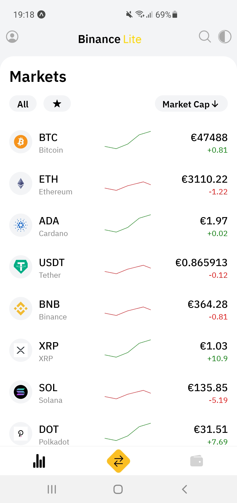
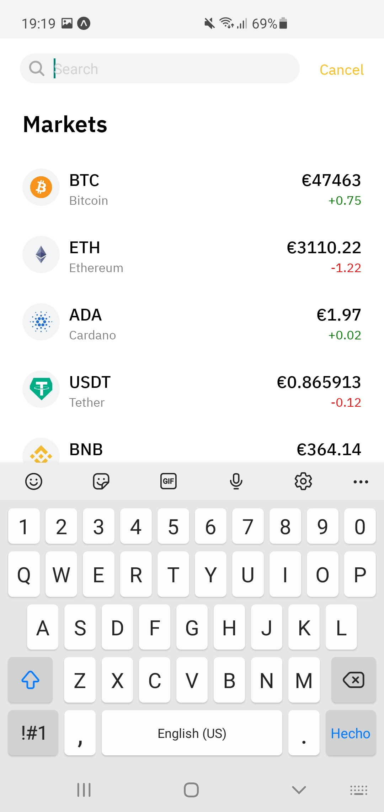
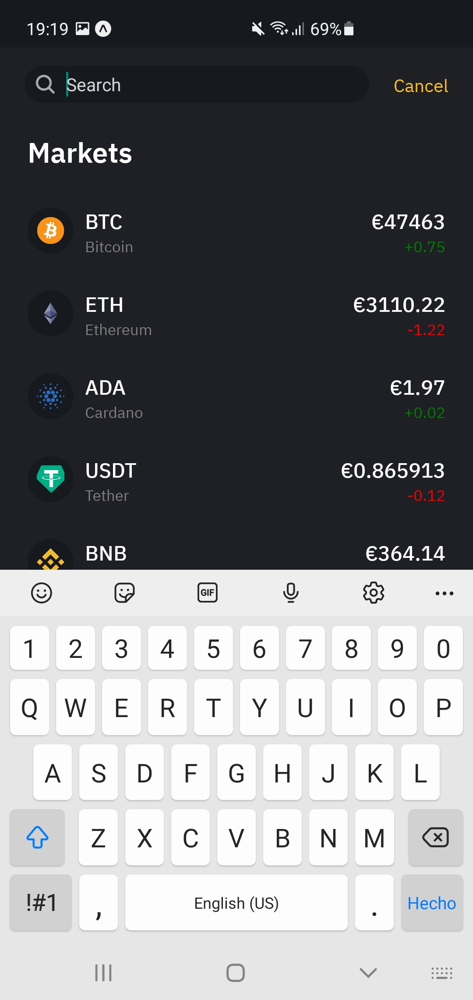
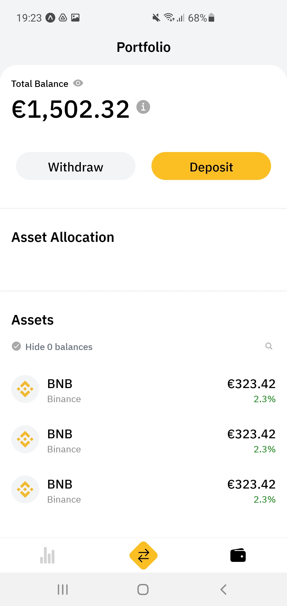

Binance lite UI clone using react native Expo with Tailwind CSS.
Also incorporates dark mode.

### About the project

Light theme                                                                   |  Dark Theme
:----------------------------------------------------------------------------:|:----------------------------------------------------------------------------:
  | 
 | 
 | 

### Built with

- React-Native(https://reactnative.dev/)
- Expo(https://docs.expo.dev/)
- React-Navigation(https://reactnavigation.org/blog/2020/02/06/react-navigation-5.0/)
- Redux(https://react-redux.js.org/)
- Redux-Thunk(https://github.com/reduxjs/redux-thunk)
- Axios(https://github.com/axios/axios)
- Tailwind-css(https://github.com/jaredh159/tailwind-react-native-classnames)

### Software prerequisites

Install the below tools/packages

| Serial No |   Software   |  Version   | Installation site                                                  |
| :-------: | :----------: | :--------: | :----------------------------------------------------------------- |
|     1     |   Node.js    | >= 14.16.1 | [Install NodeJS](https://nodejs.org/en/download/)                  |
|     2     |     npm      | >= 6.12.12 | [Install NPM](https://www.npmjs.com/get-npm)                       |
|     3     | react-native | >= 0.63.2  | [Install react-native](https://www.npmjs.com/package/react-native) |
|     4     |   expo cli   |  >= 4.7.3  | [Install Expo](https://docs.expo.dev/get-started/installation/)    |

#### Getting started

1. Clone the repo with `git clone [REPO_URL]` command
2. Switch to the project's root directory in terminal
3. Install the dependencies by running `npm install`
4. Once, 'npm install' is completed, run `npm start` to start the expo and react-native server
5. If it shows a QR code on the terminal as a result of 'exp start' command, then you are good to go!

#### Mobile setup

1. Install 'Expo' application on your android/iOS device. You can find the links to Android and iOS apps [here](https://expo.io/tools#client).
2. Scan the QR code shown on the terminal.
3. Once the QR code is successfully scanned, it will take few seconds to load and render the app.

#### App Structure

```
src/
│
└───assets/
│   └───fonts/
│   └───images/
│
└───components/
│
└───constants/
│
└───hooks/
│
└───interfaces/
│
└───navigation/
│
└───screens/
│
└───store/
    └───actions/
    └───reducers/
    └───types/

```
